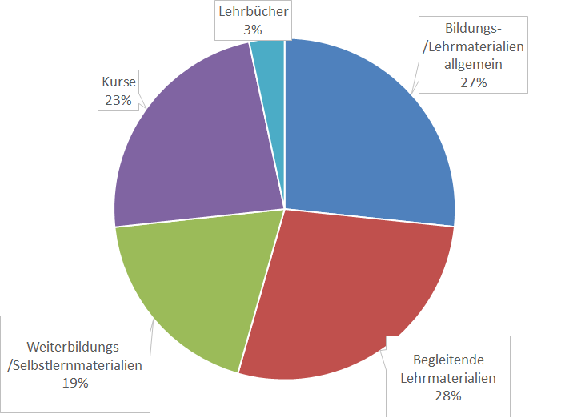
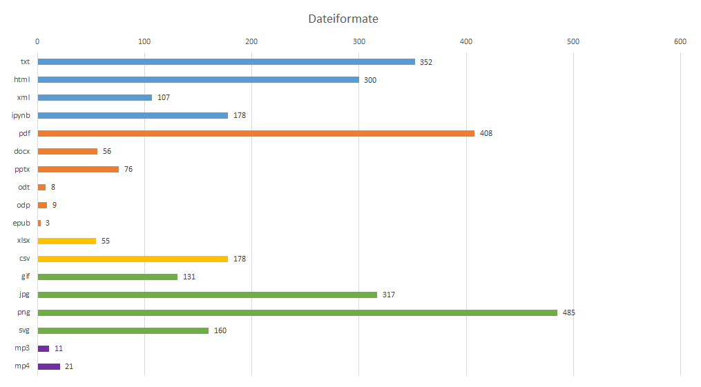
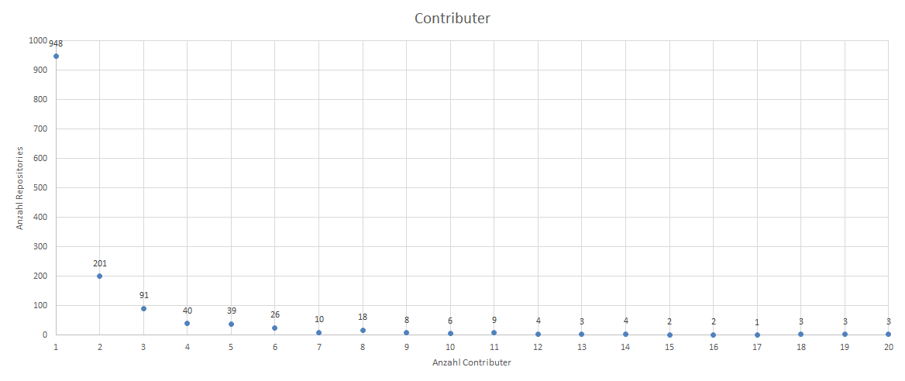
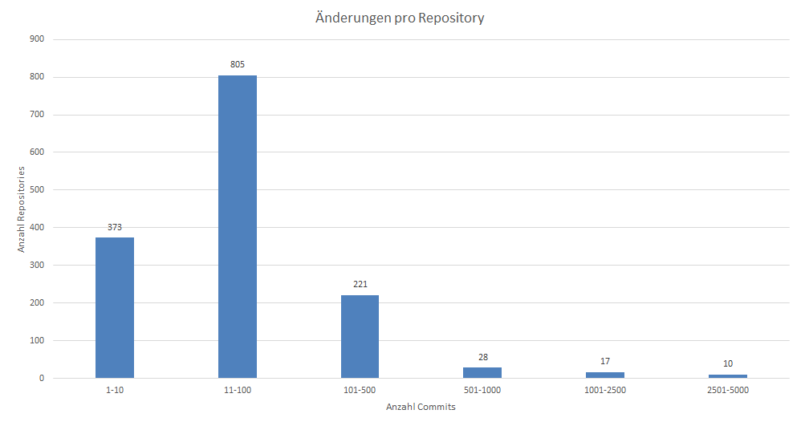
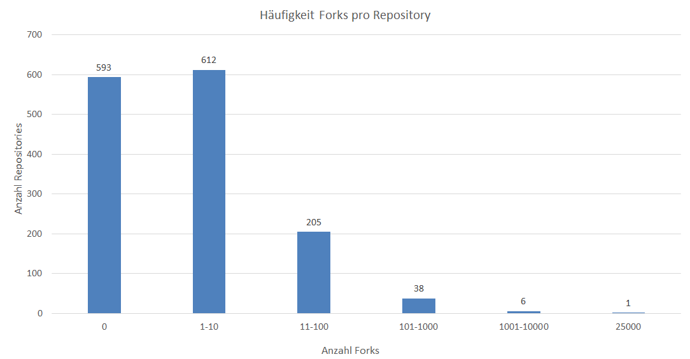
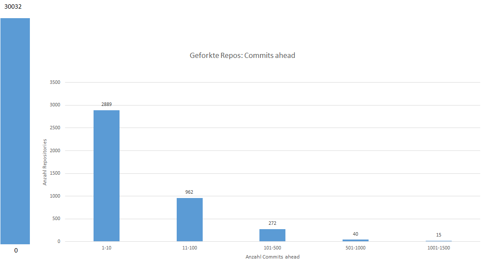
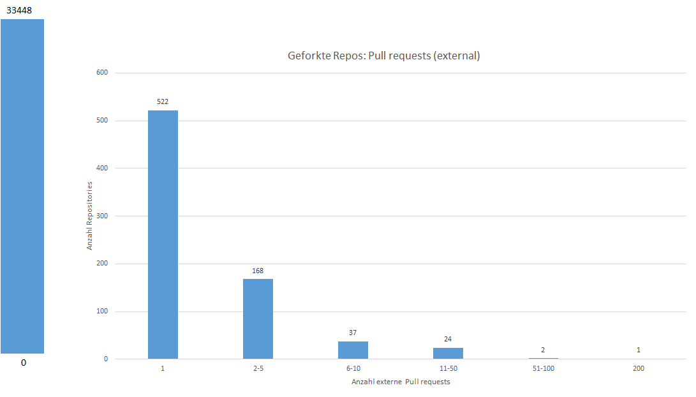

# Data evaluation

## Research questions

- Is GitHub used for educational material?
	- What are the contents / topics?
	- Which file formats are predominant?
- How and to what extent are version management functionalities applied to educational materials?
	- Changes of materials
		- Creating and editing materials (commits)
		- Division of contents (branch)
	- Reuse of materials
		- Copy of materials (forks)
		- Further development of materials (commits ahead) 
	- Cooperative use 
		- Internal employees (contributors)
		- External exchange (pull requests)

		
## Results

### Contents / Topics

Repositories with following topics are part of the sample:
- Euducational,teaching material in general
- Materials in connection to teaching scenarios (e.g. presentation, lecture, workshop)
- Training / Self-learning material
- Courses / MOOCs
- Textbooks

### Types of materials and file formats

- 38% Images 						-> materials with small extent
- 33% Textfiles 					-> open file format, display of changes possible
- 20% Documents and Presentations	-> mostly proprietary file formats

### Contributer

- 65% single person
- 35% cooperative usage with two or more contributers
- 3,5 contributer per repository on average

### Commits

- 55% medium number (11-100) of commits
- 113 commits on average
- Changes and edits are made

### Branch

- 69% Master-Branch
- 17% two Branches
- Division of content not as branches

### Forks

- 40% no forks
- 42% 1-10 forks
- Reuse takes place but to a small extent
- While there are many repos with few forks, there are also few repos with many forks

### Forked Repos: Commits ahead

- Commits ahead of forked repositories show commits in comparison to original repository
- 88% of forked repositories no commits
- Forks are used predominantly as a copy of contents than further developments are made

### Pull requests (external)

- 3% of changes are reported back to the original repository by the editors of forked repositories
- No exchange between Forks and Originals

